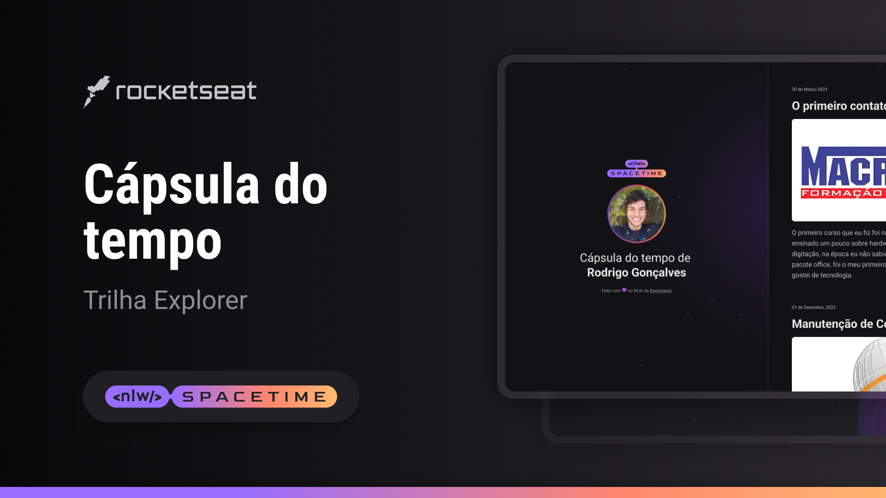

<h1 align="center">NLW Spacetime</h1>

  <a href="#-tecnologias">Tecnologias</a>&nbsp;&nbsp;&nbsp;

    Esse projeto foi desenvolvido na semana do evento NLW Spacetime como comemoração dos 6 anos da Rocketseat.

<h2 align="center">💻 Projeto finalizado</h2>

    

🚀 [Acesse por esse link o projeto online](https://github.com/danieldemoura/nlw-spacetime)

### 👨‍💻 Tecnologias

Esse projeto foi desenvolvido com as seguintes tecnologias:

- HTML e CSS
- JavaScript
- Figma

---

Feito com ♥ by Daniel :wave:

